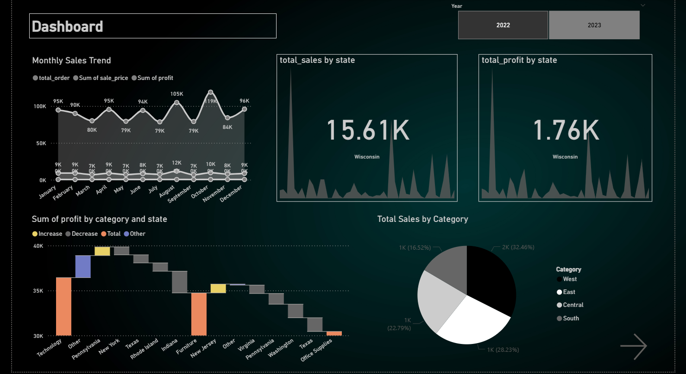
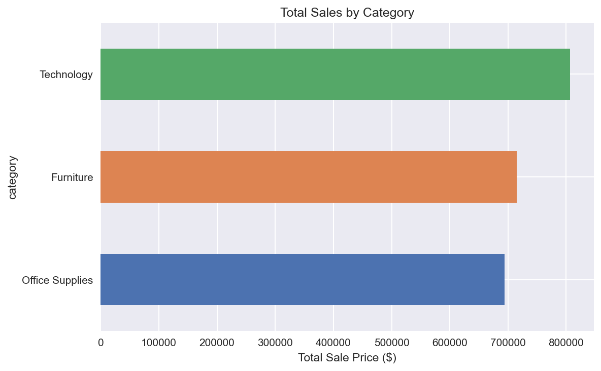
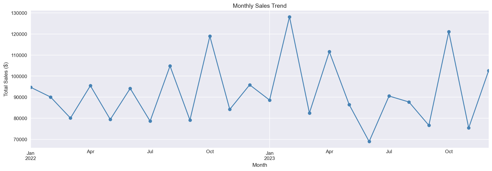
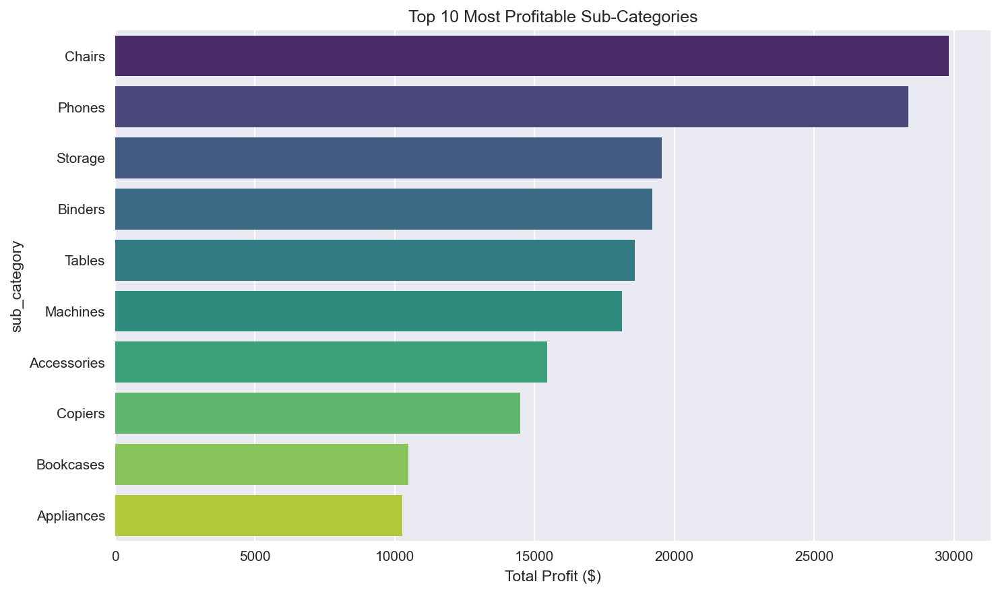
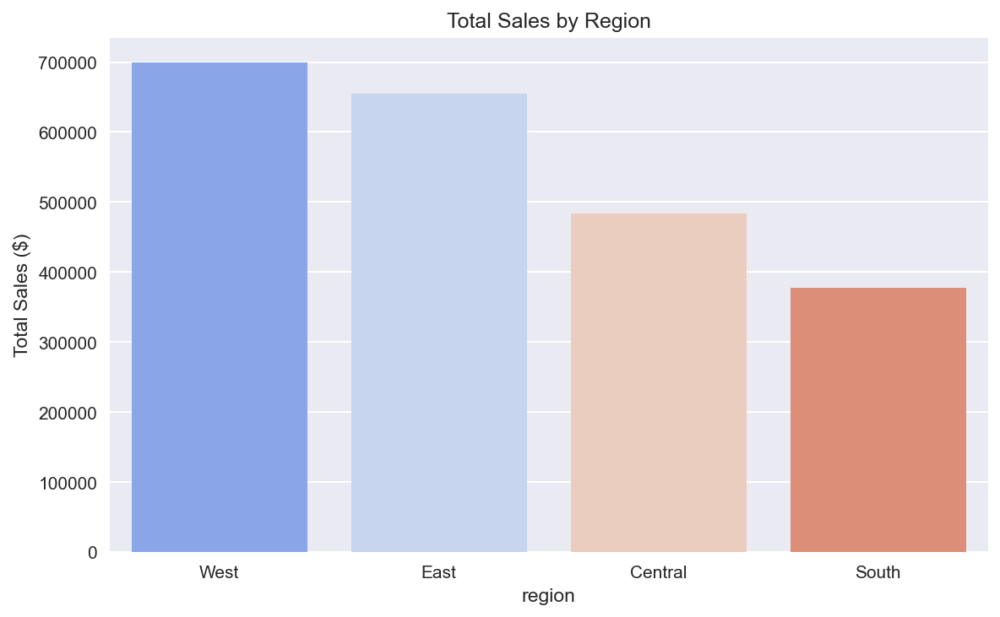

# Job Market Pulse — End-to-End Data Pipeline & Analysis

A complete data analytics project that ingests orders data from Kaggle,
processes it with Python, loads it into MySQL, performs SQL analysis,
and visualizes insights through an interactive Power BI dashboard.

## Project Pipeline
Kaggle API → Python (Cleaning & EDA) → MySQL (Storage) → SQL (Analysis) → Power BI (Dashboard)

## Tools Used
- Python (Pandas, SQLAlchemy, PyMySQL, python-dotenv, Matplotlib, Seaborn)
- Kaggle API
- MySQL
- Power BI Desktop
- Jupyter Notebook

## Project Files
- `main.ipynb` — Full pipeline: data ingestion, cleaning, EDA and visualizations
- `data_analysis.sql` — SQL queries for business analysis
- `filtered_orders.csv` — Cleaned orders dataset (9,994 rows)

## Key Insights

## Dashboard

### 📊 Sales by Category
- Technology leads with $806K in sales and 9.47% profit margin
- All 3 categories are profitable

### 🌍 Top Performing States
- California dominates with $441K in sales and $40K profit
- New York and Texas follow closely

### 🏆 Best Sub-Categories
- Chairs ($29K profit) and Phones ($28K profit) are top performers
- Binders have highest order volume (1,523 orders)

### 🌎 Region & Segment
- East Consumer segment is strongest ($338K sales)
- Central Home Office is the weakest segment ($87K sales)

### 📈 Monthly Sales Trend
- Consistent monthly sales between $80K–$94K
- Peaks observed in Q4 each year

### ❌ Loss Making Orders
- Several orders recorded exactly -$5 profit
- Concentrated in Technology and Furniture categories
- Likely caused by heavy discounting

## 📊 Key Insights

- Identified top-performing products driving revenue  
- Analyzed sales trends across time periods  
- Highlighted revenue concentration across categories  

## Security
- Database credentials stored in `.env` file
- `.env` excluded from version control via `.gitignore`

## Setup
1. Clone the repo
2. Create a `.env` file with your MySQL credentials: MYSQL_PASSWORD=your_password_here
3. Run `main.ipynb` cells sequentially